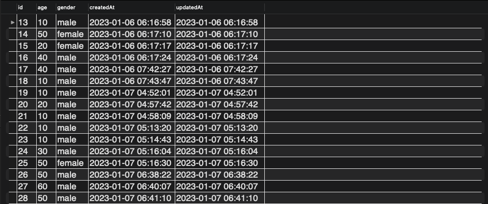
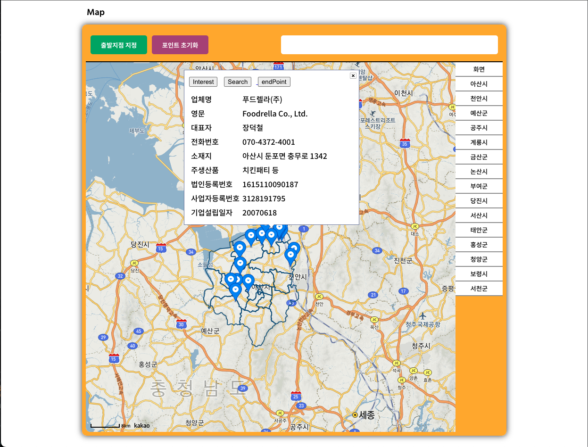
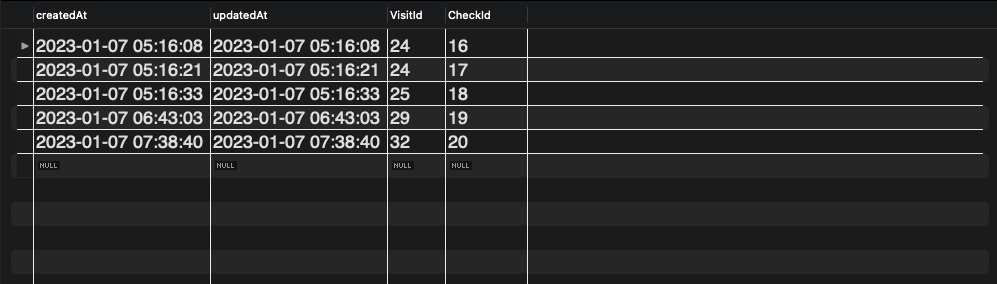

# DeepData_Prototype 1.0.0

<br>

## 😊 프로젝트 소개

### [ 공공데이터포털(OpenAPI) 및 카카오맵 API 활용한 웹어플리케이션 ]

<br>

<p>
공공데이터포털의 OpenAPI데이터 활용 및 카카오맵 API를 활용한 웹 어플리케이션으로 OpenAPI의 기업정보 데이터를 활용하여 카카오맵에 기업의 위치를 마커하고 마커에 기업정보를 담아 정보를 제공 한다. 사전 유저 정보를 통하여 접속한 유저가 관심을 가질만한 기업을 추천해주고, 접속한 유저들의 정보를 통해 연령, 성별 등을 기준으로 통계를 제공한다.
</p>

## 👐 기술 스택

<div align=center>

<h1>📚 STACKS</h1>

<div align=center> 
  
  
  
  <br>
  
  
  
  
  <br>
</div>
</div>

<br>

## 🏃 Preview 및 동작

---

<br>

- 기본 인적사항 기입 페이지

```
: 기본적인 인적사항을 클릭 후[ Go ] 버튼 클릭시 DataBase에 채크 된 인적사항을 저장 한다. <br>

1. 성별, 연령별 관심있는 지역과 관심있는 회사의 통계를 내기 위해 사용 한다.
```

<br>

<div align=center>


</div>

<br>



<br>

- 메인 페이지

<br>

<div align=center>


</div>

<br>

- 카카오맵 API 시군 및 읍면동에 대한 폴리곤 정의 및 이동

<br>

<div align=center>


</div>

<br>

- 마커 클릭 시 회사 정보 제공 및 관심 버튼 정의

```
1. 마커 클릭시 회사에 대한 정보제공 _ 회사명, 주소, 대표이름, 법인번호, 사업자번호

2. 관심 버튼 클릭시 DB에 저장
```

<br>




<br>

- 추가 정보 검색을 위한 구글 검색 연동

<br>

<div align=center>


</div>

<br>

- 출발지, 목적지 지정을 통한 포인트간 직선 거리( M 단위 ) 제공

<br>

<div align=center>


</div>

<br>

## History

1. 워크넷 api 기업 정보 불러오기

- 접근 시도
  1. redux -> server -> store (fail)
     카카오맵 api가 useEffect 내부에서 동작하므로 hoock 사용이 불가
     외부에서 useSelector을 이용해 store의 데이터를 불러오면 카카오맵 자체가 리랜더링 되면서 원하는 동작을 구현하지 못함
  2. 카카오맵 내부에서 axios를 이용해 직접적으로 서버를 접근하여 데이터 받음 (success)
