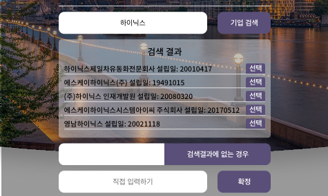
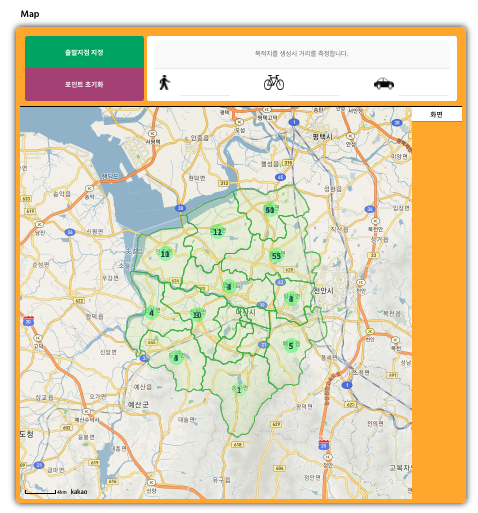
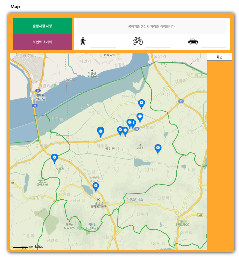
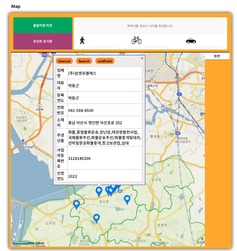
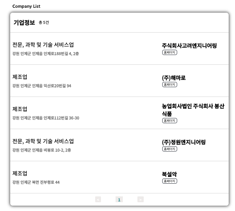
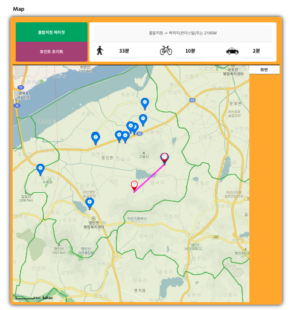

# DeepData_Prototype 1.0.1

 

## 😊 프로젝트 소개

### [ 공공데이터포털(OpenAPI) 및 카카오맵 API 활용한 웹어플리케이션 ]

 

공공데이터포털, 워크넷 OpenAPI데이터 활용 및 카카오맵 API를 활용한 웹 어플리케이션으로 공공데이터의 기업PAI를 통해 자신의 회사를 검색하는 기능을 제공하며, 워크넷의 강소기업에 대한 정보를 카카오맵과 제공되는 목록으로 표시 해준다.

## 👐 기술 스택

<h1>📚 STACKS</h1>

 
  
  
  
   
  
  
  
  
   

 

## 🏃 Preview 및 동작

---

 

- 기본 인적사항 및 공공데이터 OpenAPI를 활용한 기업검색 및 추가정보 입력

: 기본적인 인적사항을 클릭 후[ Go ] 버튼 클릭 하거나 추가정보를 입력 후 버튼을 클릭시 DataBase에 입력한 인적사항을 저장 한다.

 

Join Page preview

  
재직중인 기업을 검색하여 선택할 수 있다.

  
공공데이터포털의 '금융위원회_기업기본정보' API를 활용하였다.

  

  
자신의 회사가 검색결과가 없는 경우 직접 입력하는 공간을 제공한다.

  

---

 

- 카카오맵API 및 워크넷 기업정보API를 활용하여 정보 제공

main Page Preview

도 - 시군구 - 읍면동 단위 폴리곤

'도'를 클릭시 '시'별 내에 있는 강소기업의 수를 표시해준다.

'시'를 클릭시 강소기업의 정보를 담고있는 마커를 제공한다.

마커를 클릭하여 기업의 정보를 확인 할 수 있으며 관심 버튼을 클릭하여 join 페이지에서 입력한 자신의 인적사항과 해당 기업을 DB에 저장할 수 있으며, 구글검색으로 이어주거나, 목적지로 선택 할 수 있다.

도, 시 단위 클릭시 해당 단위 내의 회사 기본정보 제공 및 페이지네이션 구현

해당 지역의 기업을 리스트로 제공 및 페이지네이션을 구현 하였다.

두 지점간 직선 거리 및 소요시간(도보, 자전거, 차) 제공

출발지 - 목적지 간 거리및 소요시간 제공

